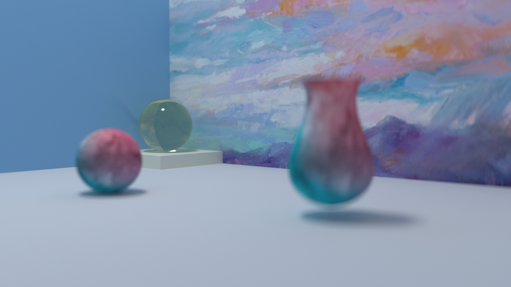

# Photo Realistic Rendering - 2019 Computational Graphics

## Basic Functions
+ Multiple parametric objects supported, i.e. plane, sphere, cube and rotary bezier curve 
+ Mesh object (loaded via OBJ file) 
+ Stackless KD-tree accelaration 
+ Axis aligned boundingbox 
+ Nvidia CUDA support (much faster than CPU implementation using OpenMP) 
+ Surface texture mapping 
+ Natural depth of field 
+ ...

## Supported Render Algorithms
+ Path Tracing with Anti-aliasing (CPU and GPU) 
+ Stochastic Progressive Photon Mapping (CPU only) 

## Dependencies
+ OpenCV (for reading texture image, i.e., jpeg or png)
+ CUDA (if you want to compile GPU version) 

## Build and Execution
```
mkdir build && cd build 
cmake ../src -DCMAKE_BUILD_TYPE=release -DBUILD_CUDA=true|false -DBUILD_TEST=true|false ## Enable CUDA or test building according to your need 
make
```

To render, use the following command 
```
./main PT [out_filename] [width] [height] [num_spp]
./main SPPM [out_filename] [width] [height] [num_rounds] [num_photons_per_round]
./main_gpu [out_filename] [width] [height] [num_spp]
```

## Demo image
### Simple Ray Cast

### Rotary Bezier Curve Demo

### Final GPU Demo


For more details, refer to the `demo` directory.

## References
1. Hachisuka, Toshiya, Shinji Ogaki, and Henrik Wann Jensen. "Progressive photon mapping." In ACM Transactions on Graphics (TOG), vol. 27, no. 5, p. 130. ACM, 2008.
2. Hachisuka, Toshiya, and Henrik Wann Jensen. "Stochastic progressive photon mapping." In ACM Transactions on Graphics (TOG), vol. 28, no. 5, p. 141. ACM, 2009.
3. Popov, Stefan, Johannes Günther, Hans‐Peter Seidel, and Philipp Slusallek. "Stackless kd‐tree traversal for high performance GPU ray tracing." In Computer Graphics Forum, vol. 26, no. 3, pp. 415-424. Oxford, UK: Blackwell Publishing Ltd, 2007.
